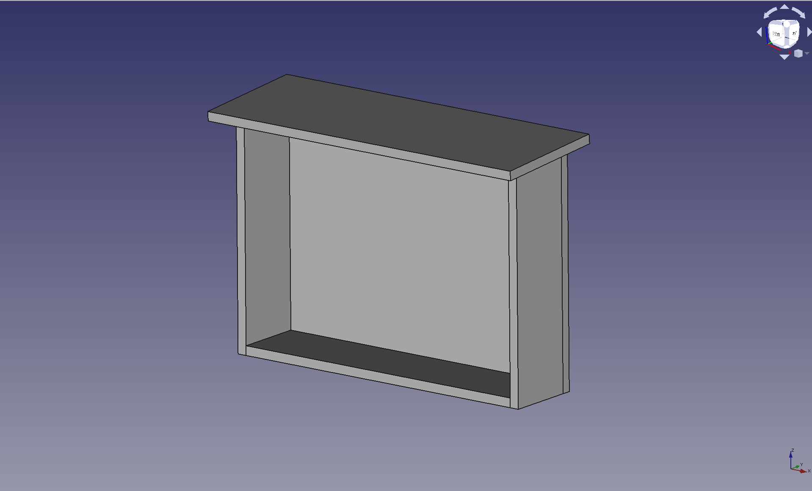
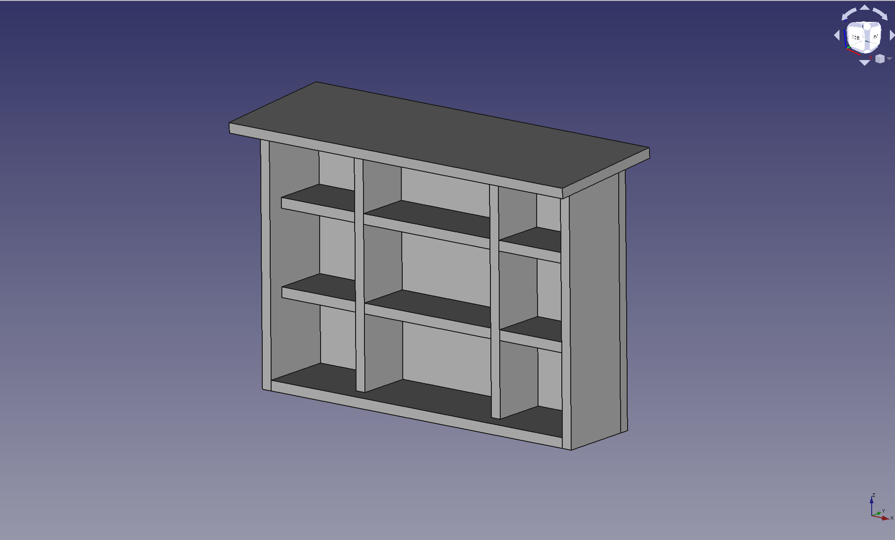
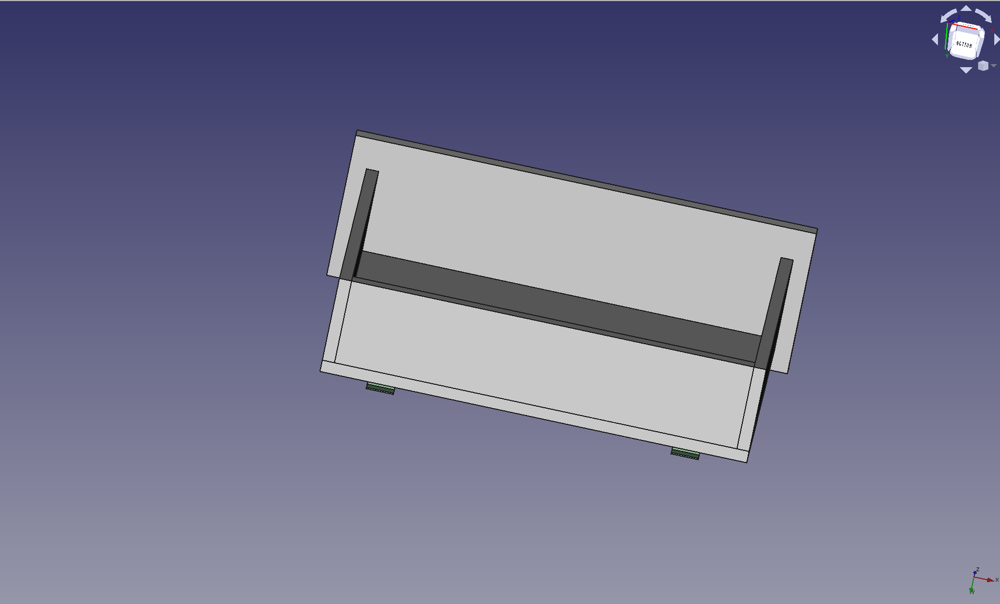

# Insektenhotel

## Motivation
Wir leben in einem moderenen Zeit, wo die Gärten oft penibel angelegt und aufgeräumt sind. Rasenabfälle, Laubreste oder Schnitte von Sträuchen werden gleich entsorgt. Die Folge ist, dass die Lebensärume für die nützlichen Insekten verloren gehen. Die Insekten haben somit immer schwerer geeignete Plätze zum Nisten oder Überwintern zu finden.

Ein Grossteil der Pflanzen sind auf die Bestäubung durch die Insekten angewiesen. Einige Nahrungsmittel gar nicht verfügbar wäre, da eine grössere Gleichmässigkeit und eine höhere Ernte nicht möglich wäre. Die Folge wären z.B. Monokulturen und intensive bekämpfung durch Pestizide. Zudem würde es auch zahlreiche Tier- und Pflanzenarten nicht mehr geben.

Es gibt viele Insektenhotel aus hiesigen Baumärkten, die eher für die Menschen/KäuferInnen gebaut sind als für die Insekten selber. Um einige Beispiele zu nennen:
* Tannenzäpfe sind gute Lückenfüller aber für die Insekten nutzlos
* Die Bambus / Hohlräume sind nicht sauber verarbeitet
* Holz wurde chemisch behandelt bzw. gefärbt
* Ungeeignet für Florfliegen; Kammer ist zu klein
* Schlitze für die Schmetterlinge bleiben ungenutzt

Die meisten Informationen was zu beachten zu wären könnte einen mit die Informationfülle "erschlagen", aber es gibt einige Webseiten die aufzeigen was "Sinn" und was "Unsinn" ist: https://insektenhotels.net, https://www.naturgartenfreude.de

Das Insektenhotel leistet einen wichtigen Betrag zur Natur indem wir die Insekten ein Zuhause für alle Jahreszeiten geben. Zudem sind die Insekten auch sehr interessant für die Kleinen und die Grossen. Das sind meine Motivationen ein Insektenhotel zu planen und bauen das wirklich insektenfreundlich ist.

## Planung, Dimensionen und Kosten
Das Insektenhotel wurde mit FreeCAD (https://www.freecad.org/) geplant und beim Holz habe ich stets geachtet, dass das Holz unlackiert und wasserfest geleimt sind und hauptsächlich aus Bambusröhre besteht. Ihr könnt natürlich eure Kammern mit andere Materialien füllen, aber ich empfehle euch vorgängig zu informieren, was wirklich für die Insekten sinnvoll sind und was zu beachten wäre.

Die Länge beträgt *680 mm*, die Breite *470 mm* und die Tiefe *230 mm*. Gefüllt mit ca *1300 Bambusröhren*. Die üblichen Materialien wie Holz, Dübeln findet ihr bei euren Baumärkten (Jumbo, Hornbach, Obi, ...). Die Mini-Dachschindeln habe ich auf der Webseite https://mini-dachschindeln-shop.de bestellt. Die Bambusröhre habe ich in grosse Mengen bei Amazon bestellt und Jeff Bezos somit zu seiner weiteren Milliarde verholfen. Also keine Hexerei und keine geheime Verkaufskanäle meinerseits.

Für das Material habe ich knapp *230 CHF* ausgegeben, also wesentlich teurer als ein fertiges Insektenhotel, aber dafür mit Liebe und hoher Qualität 🥰 . Spass hat es auch gemacht!

## Plan

Die **[Insektenhotel.FCStd](Insektenhotel.FCStd)** Datei wurde mit FreeCAD 0.19 erstellt.

Lizenz ist [CC0 1.0 Universell - Public Domain Dedication](https://creativecommons.org/publicdomain/zero/1.0/deed.de) und somit könnt ihr mit dem Plan machen was ihr wollt. Gerne könnt ihr die Datei herunterladen und ein eigenes, individuelles Insektenhotel daraus machen.

## Druckvorlagen

Wer nicht mit FreeCAD arbeiten möchte, kann gerne die fix-fertige Vorlagen herunterladen und ausdrucken:
[Rückenwand](Druckvorlagen/01 Rückenwand.pdf)
[Seite](Druckvorlagen/02 Seite.pdf)
[Boden](Druckvorlagen/03 Boden.pdf)
[Dach](Druckvorlagen/04 Dach.pdf)
[Zaunbefestigung](Druckvorlagen/05 Zaunbefestigung.pdf)
[Inneneinteilung - Waagrecht](Druckvorlagen/06 Inneneinteilung Waagrecht.pdf)
[Inneneinteilung - Senkrecht](Druckvorlagen/07 Inneneinteilung Senkrecht.pdf)

## 3D Ansicht

## Fotos

